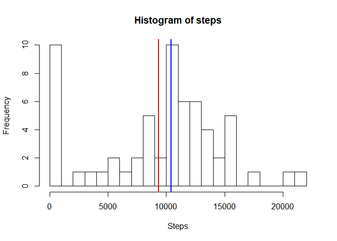
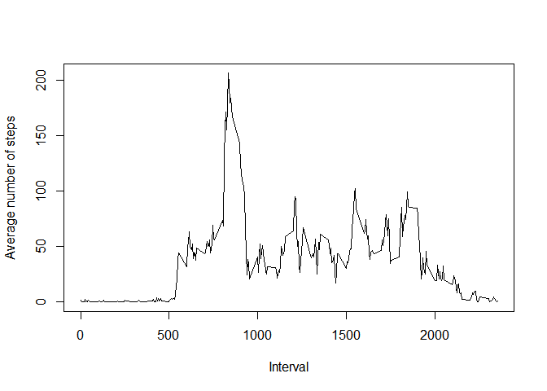
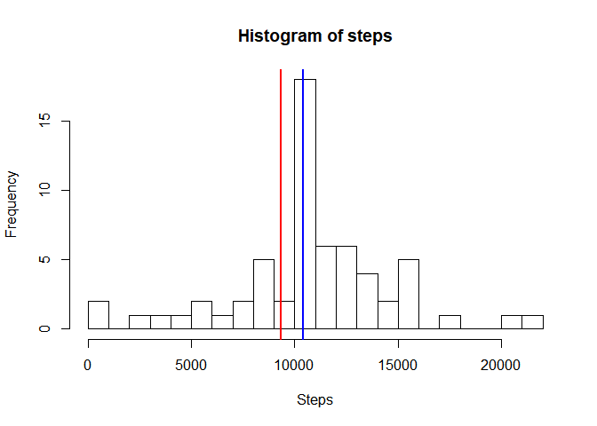
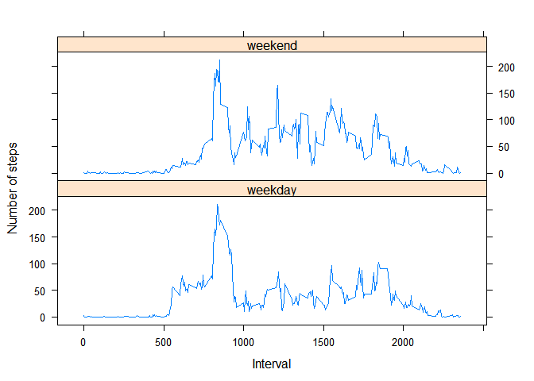

## Loading and preprocessing the data

```r
library(dplyr)
```

```
## Warning: package 'dplyr' was built under R version 3.5.1
```

```
## 
## Attaching package: 'dplyr'
```

```
## The following objects are masked from 'package:stats':
## 
##     filter, lag
```

```
## The following objects are masked from 'package:base':
## 
##     intersect, setdiff, setequal, union
```

```r
library(lubridate)
```

```
## Warning: package 'lubridate' was built under R version 3.5.1
```

```
## 
## Attaching package: 'lubridate'
```

```
## The following object is masked from 'package:base':
## 
##     date
```

```r
library(lattice)

d <- read.csv(unz("activity.zip", "activity.csv"))
```


## What is mean total number of steps taken per day?

### Histogram of steps

```r
mean1 <- mean(d$steps, na.rm=TRUE)
median1 <- median(d$steps, na.rm=TRUE)

hist(d$steps, xlab="Steps", main="Histogram of steps", breaks=30)
abline(v=mean1, col="red", lwd=2)
abline(v=median1, col="blue", lwd=2)
```

<!-- -->

The mean of steps (marked in red) is 37.3825996, while the median (marked in blue) is 0.


## What is the average daily activity pattern?

```r
davg <- d %>% group_by(interval) %>% summarise(avg=mean(steps, na.rm=TRUE))
plot(davg$interval, davg$avg, type="l", xlab="Interval")
```

<!-- -->

On average over all days, we can see that maximum number of steps is taken around interval #800. Let's confirm this:


```r
davg[davg$avg==max(davg$avg),]
```

```
## # A tibble: 1 x 2
##   interval   avg
##      <int> <dbl>
## 1      835  206.
```

## Imputing missing values
Let's calculate the number of NAs

```r
sum(is.na(d$steps))
```

```
## [1] 2304
```

and their percentage of the total

```r
mean(is.na(d$steps))
```

```
## [1] 0.1311475
```
Around 13% of the values are NA.

Let's imput them by calculating the mean for that 5-minute interval.


```r
mean.steps <- summarise(group_by(d, interval), avg=mean(steps, na.rm=TRUE))
d2 <- left_join(d, mean.steps)
d2[is.na(d2$steps), ]$steps <- d2[is.na(d2$steps), ]$avg
d2$weekday <- "weekday"
d2[wday(d2$date) == 1 |  wday(d2$date) == 6, ]$weekday <- "weekend"
d2$weekday <- as.factor(d2$weekday)
```


```r
davg2 <- d2 %>% group_by(interval) %>% summarise(avg=mean(steps)) 
plot(davg2$interval, davg2$avg, type="l", xlab="Interval")
```

<!-- -->


```r
mean2 <- mean(d2$steps)
median2 <- median(d2$steps)

hist(d2$steps, xlab="Steps", main="Histogram of steps taken each day", breaks=30)
abline(v=mean2, col="red", lwd=2)
abline(v=median2, col="blue", lwd=2)
```

<!-- -->

The mean of steps is 37.3825996, while the median is 0.


We can see no difference after imputting missing values as the method follow to imput them has been to calculate the average of the non-empty values for that particular interval, which, or course, does not change the average per interval.


## Are there differences in activity patterns between weekdays and weekends?
From the charts below it can be seen that activity starts somewhat later during the weekend and is higher (i.e. less sedentary) during the middle of the day than it is for weekdays.


```r
davg.weekdays <- d2 %>% group_by(interval, weekday) %>% summarise(avg=mean(steps)) 
xyplot(avg ~ interval | weekday, davg.weekdays, layout=c(1,2), xlab="Interval", ylab="Number of steps")
```

<!-- -->
